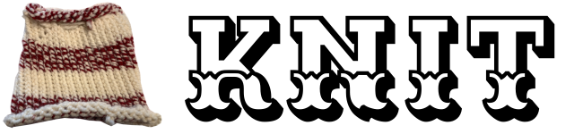

# Knit - Dataweave Document Generator

Written by Austin Lehman

Knit is a Maven plugin that generates documentation from source code 
comments in DataWeave files. 

Here's how it works. You write comments like this in your dwl files.

```
/**
 * Maps a color object to a result color object.
 * @p data is an input color object.
 * @r a result color object.
 */
fun mapColor(data) = {
...
```
 
Then you add the plugin to your pom like this.

```
<plugin>
    <groupId>io.github.rsv-code</groupId>
    <artifactId>knit-maven-plugin</artifactId>
    <version>1.0.4</version>
    <executions>
        <execution>
            <goals>
                <goal>knit</goal>
            </goals>
        </execution>
    </executions>
</plugin>
```

Then when you build your project it will generate a knit-doc.md file in the 
target directory. It's that simple.

# Dependencies
Knit requires JDK 8 or later. It may work on previous versions but you will 
need to update the pom.xml in that case. It also requires maven of course.


# Usage

Since this is a Maven plugin all you have to do is reference it in the 
pom.xml of the project you want to use it in. The plugin exists in Maven 
Central Repository so adding this to the pom is all that's needed.

```
<plugin>
    <groupId>io.github.rsv-code</groupId>
    <artifactId>knit-maven-plugin</artifactId>
    <version>1.0.4</version>
    <executions>
        <execution>
            <goals>
                <goal>knit</goal>
            </goals>
        </execution>
    </executions>
    <configuration>
        <!-- Generate docs ... run the plugin? -->
        <generate>true</generate>
        
        <!-- Make a single output file. -->
        <singleOutputFile>true</singleOutputFile>
        
        <!-- Direcories to look for files to parse. By default src/main/resources/dw is set by the plugin.
        <directories>
            <dir>src/main/resources/dw</dir>
        </directories>
        -->
        
        <!-- Individual files can be listed to parse.
        <files>
            <file>test1.dwl</file>
            <file>test2.dwl</file>
        </files>
         -->
         
         <!-- Specify the output file to save to. By default it saves to target/knit-doc.md.
         <outputFile>target/knit-doc.md</outputFile>
         -->
         
         <!-- Optional output header text can be specified which is set at the 
            begining of the generated doc. This allows you to set a heading 
            section for the doc.
         -->
         <!--
         <outputHeaderText>
<![CDATA[
# knit-test

This app is for testing the knit maven plugin.

]]>
          </outputHeaderText>
          -->
          
          <!-- If set to true a header table will be generated.
          <writeHeaderTable>true</writeHeaderTable>
          -->
          
          <!-- Provide a list of modules in the order you want them to appear.
          <moduleList>
              <module>main</module>
              <module>palette</module>
          </moduleList>
          -->
         
    </configuration>
</plugin>
```

The configuration section is optional, if not specified it will use 
the default values which should work for most cases.

- **generate** - A flag to run or not to run the Knit doc generator. Set 
  to false if you want it to skip generation.
- **singleOutputFile** - A flag to specify if it should generate a single 
  output file or a file for each module. Currently only single output file 
  is supported.
- **directories** - A list of directories to look for .dwl files. If not 
  specified it will look in rc/main/resources/dw. If specified it will look 
  at just those directories you set.
- **files** - A list of files parse.
- **outputFile** - A string with the output file to write to. By deafult this 
  writes to target/knit-doc.md.
- **outputHeaderText** - Text to be set at the very begining of the generated 
  doc. This is optional and exists to allow some custom introduction content 
  to be provided.
- **writeHeaderTable** - A flag to specify if a header table is to be generated. 
  If set to true a table with each module name and description will be built 
  below the outputHeaderText and before the regular documentation. Each module 
  will link to it's place in the document.
- **moduleList** - A list of strings with the module names. This list 
  allows you to specify the order that modules will be written.


# Comments

There are 3 comment blocks that can be used to generate docs and they are 
module, variable, and function.

Module level documentation is set at the very begining of the module before 
the %dw declaration and starting with /** like this.
```
/**
 * This module supports color realted functions.
 */

%dw 2.0
...
```

Variable documentation is implemented by writing a comment block above the 
variable declaration.
```
/**
 * First name of the author.
 */
var first = "Austin"
```

Finally, documentation of a function is accomplished by writing a comment block 
above the function. In function comments you can set annotations to define 
parameters and return values by using @p and @r respectively. 
```
/**
 * Maps a color object to a result color object.
 * @p data is an input color object.
 * @r a result color object.
 */
fun mapColor(data) = {
...
```

# Installing Locally

Normally you should just be able to add the plugin to your pom and away you go. In 
the event that you want to builld and install from source, here's how it's done. 
To install the plugin locally just clone the repo and then install with maven.
```
$ git clone git@github.com:rsv-code/knit.git
$ cd knit
$ mvn clean install
```

Done and done, that's all you need to use in your project. Just add it to 
the pom.xml and you're golden.

# License
Copyright 2020 Roseville Code Inc. (austin@rosevillecode.com)

This program is free software: you can redistribute it and/or modify
it under the terms of the GNU General Public License as published by
the Free Software Foundation, either version 3 of the License, or
(at your option) any later version.

This program is distributed in the hope that it will be useful,
but WITHOUT ANY WARRANTY; without even the implied warranty of
MERCHANTABILITY or FITNESS FOR A PARTICULAR PURPOSE.  See the
GNU General Public License for more details.

You should have received a copy of the GNU General Public License
along with this program.  If not, see <https://www.gnu.org/licenses/>.